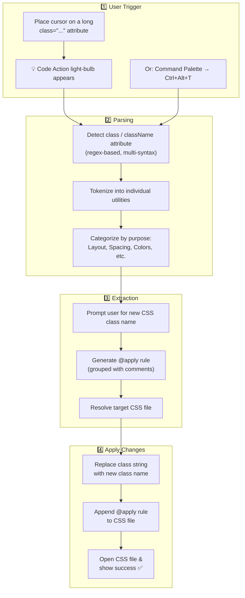
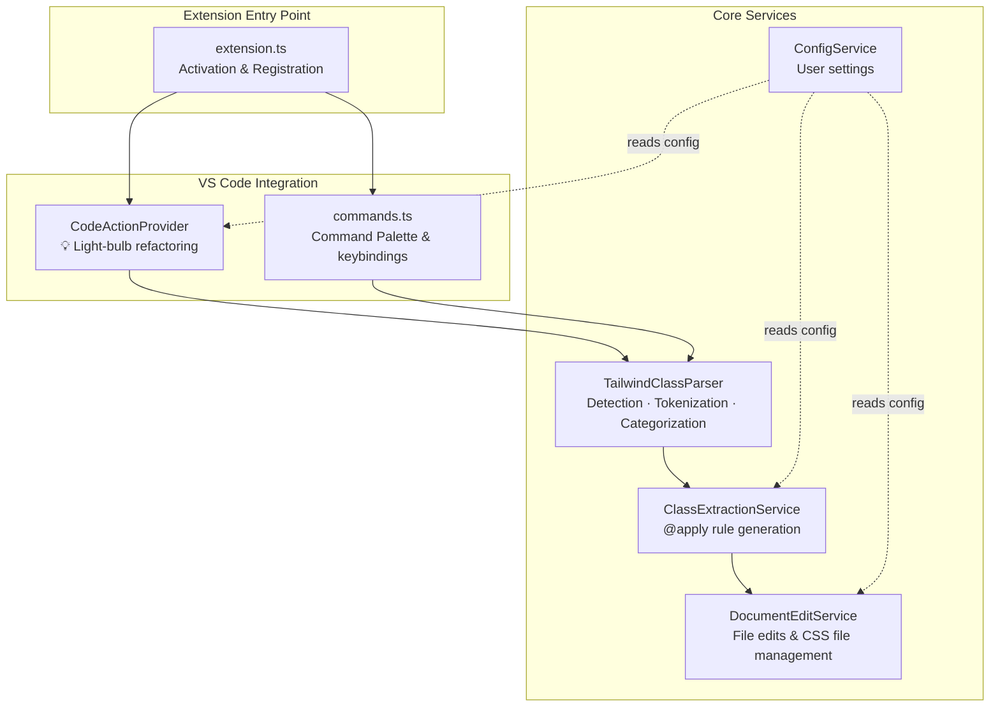
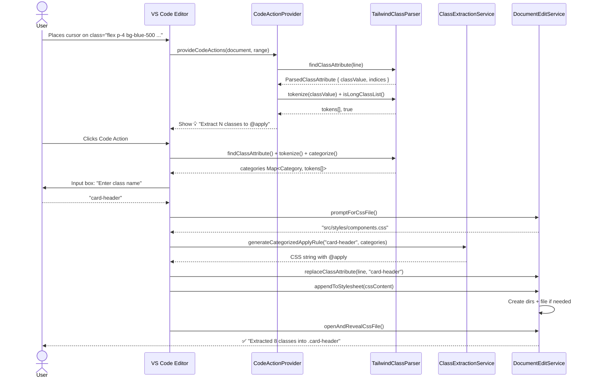

# Architecture & Design Flow

> How Shrink Tailwind Class works under the hood.

---

## High-Level User Flow



---

## Module Architecture



---

## File Map

```
src/
├── extension.ts                    ← Entry point: registers everything
├── codeActionProvider.ts           ← Detects long classes → offers 💡 actions
├── commands.ts                     ← 10-step extraction orchestration
└── services/
    ├── tailwindClassParser.ts      ← Regex detection, tokenizer, categorizer
    ├── classExtractionService.ts   ← Generates @apply CSS output
    ├── documentEditService.ts      ← VS Code edits, file creation, prompts
    └── configService.ts            ← Reads shrinkTailwind.* settings
```

---

## Data Flow (step by step)



---

## Class Categorization

The parser groups Tailwind utilities into these categories (in display order):

| Category | Example Classes |
|----------|----------------|
| **Layout** | `flex`, `grid`, `hidden`, `absolute`, `z-10` |
| **Flexbox & Grid** | `items-center`, `justify-between`, `gap-4` |
| **Spacing** | `p-4`, `mx-auto`, `mt-2`, `space-y-4` |
| **Sizing** | `w-full`, `h-screen`, `max-w-lg` |
| **Typography** | `text-lg`, `font-bold`, `uppercase`, `leading-tight` |
| **Colors** | `bg-blue-500`, `text-white`, `from-purple-600` |
| **Borders & Radius** | `rounded-lg`, `border`, `ring-2` |
| **Effects** | `shadow-md`, `opacity-75`, `blur-sm` |
| **Transitions & Animation** | `transition-all`, `duration-300`, `animate-spin` |
| **Transforms** | `scale-105`, `rotate-45`, `translate-x-2` |
| **Interactivity** | `cursor-pointer`, `select-none`, `scroll-smooth` |
| **States** | `hover:bg-blue-700`, `md:flex`, `dark:text-white` |

> **Special case:** `text-` prefix is disambiguated — `text-lg`/`text-center` → Typography, `text-blue-500` → Colors.

---

## Configuration Reference

| Setting | Type | Default | Effect |
|---------|------|---------|--------|
| `shrinkTailwind.classThreshold` | `number` | `5` | Min classes to trigger 💡 suggestion |
| `shrinkTailwind.targetCssFile` | `string` | `src/styles/components.css` | Default file for `@apply` rules |
| `shrinkTailwind.groupByCategory` | `boolean` | `true` | Group output with category comments |
| `shrinkTailwind.preserveStateVariants` | `boolean` | `false` | Keep `hover:`, `md:` etc. inline |
